## DeliverTable – ER Model (Mermaid)

This document describes a **conceptual / logical ER model** for DeliverTable using Mermaid.
It is designed to be **framework‑agnostic**, **Stripe‑ready**, and stable enough to evolve as the platform grows.

### Conventions & assumptions

- **ID types**: use opaque, non‑guessable identifiers (e.g. UUID/ULID) for primary keys exposed outside the system; integers are acceptable for purely internal keys.
- **Timestamps**: all date/time fields are stored as **UTC, timezone‑aware values** (e.g. PostgreSQL `timestamptz`); any local times are converted at the application/UI layer only.
- **Soft deletion**: where indicated, use flags (e.g. `is_active`, `deleted_at`) instead of hard deletes to preserve audit history.
- **Users & roles**: a single `USER` table with role(s) to support **customers**, **restaurant owners**, and **administrators**; specialized tables extend `USER` by composition (1‑to‑1).
- **Stripe integration**: `PAYMENT` persists Stripe identifiers (e.g. `stripe_payment_intent_id`) and never stores raw card data.
- **Status fields**: enumerations (e.g. `PENDING`, `CONFIRMED`, `CANCELLED`, `REJECTED`, `PAID`, `REFUNDED`) should be modeled as constrained types/enums in code and DB.

> This is a **domain‑oriented ER model**. Physical implementation details (indexes, partitions, etc.) are intentionally omitted from the diagram but should be added at DB design time.

---

### Full ER diagram (single Mermaid graph)

```mermaid
erDiagram
    %% Core accounts, profiles & restaurants
    USER {
        string  id PK
        string  email
        string  password_hash
        string  role                "CUSTOMER | RESTAURANT_OWNER | ADMIN"
        string  status              "ACTIVE | SUSPENDED | BANNED"
        string  first_name
        string  last_name
        datetime created_at
        datetime updated_at
    }

    CUSTOMER_PROFILE {
        string  user_id PK, FK
        string  allergy_notes       "Free‑text and/or structured JSON"
        string  dietary_preferences
        boolean marketing_opt_in
        datetime created_at
        datetime updated_at
    }

    RESTAURANT_OWNER_PROFILE {
        string  user_id PK, FK
        string  company_name
        string  vat_number
        string  contact_phone
        datetime created_at
        datetime updated_at
    }

    RESTAURANT {
        string  id PK
        string  owner_user_id FK
        string  name
        string  restaurant_type     "e.g. ITALIAN, STEAKHOUSE, VEGAN"
        string  description
        string  address_line1
        string  address_line2
        string  city
        string  postal_code
        string  country
        float   latitude
        float   longitude
        boolean is_active
        datetime created_at
        datetime updated_at
    }

    RESTAURANT_TABLE {
        string  id PK
        string  restaurant_id FK
        string  label              "e.g. T1, Terrace‑A"
        int     capacity
        boolean is_active
        datetime created_at
        datetime updated_at
    }

    %% Menus, promotions, loyalty & preferences
    MENU_ITEM {
        string  id PK
        string  restaurant_id FK
        string  name
        string  description
        string  type_of_dish       "STARTER | MAIN | DESSERT | APERITIF | BEVERAGE"
        float   base_price
        boolean is_vegetarian
        boolean is_vegan
        boolean is_gluten_free
        boolean is_allergen_hazard  "true if must be hidden for some customers"
        boolean is_dish_of_the_day
        boolean is_active
        datetime created_at
        datetime updated_at
    }

    PROMOTION {
        string  id PK
        string  restaurant_id FK
        string  name
        string  description
        string  discount_type      "PERCENTAGE | FIXED_AMOUNT"
        float   discount_value
        datetime starts_at
        datetime ends_at
        boolean is_active
        datetime created_at
        datetime updated_at
    }

    LOYALTY_PROGRAM {
        string  id PK
        string  restaurant_id FK
        string  name
        string  description
        string  rules_schema        "JSON describing earning/redeeming rules"
        boolean is_active
        datetime created_at
        datetime updated_at
    }

    LOYALTY_ACCOUNT {
        string  id PK
        string  loyalty_program_id FK
        string  customer_user_id FK
        int     points_balance
        datetime created_at
        datetime updated_at
    }

    LOYALTY_TRANSACTION {
        string  id PK
        string  loyalty_account_id FK
        string  type               "EARN | REDEEM | ADJUST"
        int     points
        string  source             "BOOKING_ID or admin adjustment"
        datetime created_at
    }

    DISCOUNT_CODE {
        string  id PK
        string  restaurant_id FK
        string  code
        string  description
        string  discount_type
        float   discount_value
        datetime valid_from
        datetime valid_until
        int     max_redemptions
        int     per_user_limit
        boolean is_active
        datetime created_at
        datetime updated_at
    }

    CUSTOMER_FAVOURITE_RESTAURANT {
        string  customer_user_id FK
        string  restaurant_id FK
        datetime created_at
    }

    CUSTOMER_HIDDEN_RESTAURANT {
        string  customer_user_id FK
        string  restaurant_id FK
        datetime created_at
    }

    %% Bookings, pre‑orders, payments (Stripe‑ready)
    BOOKING {
        string  id PK
        string  restaurant_id FK
        string  customer_user_id FK
        string  restaurant_table_id FK "nullable for generic bookings"
        datetime scheduled_at
        int     party_size
        string  status              "PENDING | CONFIRMED | CANCELLED | REJECTED | COMPLETED"
        string  special_requests    "seating, dietary requirements"
        string  source              "CUSTOMER_APP | RESTAURANT_PORTAL | ADMIN"
        boolean is_event_booking
        datetime created_at
        datetime updated_at
    }

    BOOKING_RULE {
        string  id PK
        string  restaurant_id FK
        float   min_confirm_amount
        int     min_lead_time_hours     "no booking before X hours in advance"
        int     max_advance_days        "no booking beyond Y days"
        int     slot_duration_minutes   "duration of one slot"
        string  availability_ranges     "JSON: time ranges per day"
        boolean allow_preorder
        boolean allow_delivery
        datetime created_at
        datetime updated_at
    }

    BOOKING_BLOCKED_SLOT {
        string  id PK
        string  restaurant_id FK
        string  restaurant_table_id FK "optional; null = whole restaurant"
        datetime starts_at
        datetime ends_at
        string  reason
        datetime created_at
    }

    BOOKING_ITEM {
        string  id PK
        string  booking_id FK
        string  menu_item_id FK
        int     quantity
        float   unit_price
        float   total_price
    }

    PAYMENT {
        string  id PK
        string  booking_id FK
        string  provider          "STRIPE"
        string  stripe_payment_intent_id
        string  stripe_charge_id  "optional, depending on Stripe mode"
        float   amount
        string  currency
        string  status            "REQUIRES_PAYMENT_METHOD | REQUIRES_CONFIRMATION | SUCCEEDED | CANCELED | REFUNDED"
        datetime authorized_at
        datetime captured_at
        datetime canceled_at
        datetime created_at
        datetime updated_at
    }

    BOOKING_DISCOUNT_CODE {
        string  booking_id FK
        string  discount_code_id FK
        float   applied_amount
    }

    %% Events, ratings, notifications & moderation
    EVENT {
        string  id PK
        string  restaurant_id FK    "nullable when customer‑hosted, off‑site"
        string  created_by_user_id FK
        string  name
        string  description
        datetime starts_at
        datetime ends_at
        int     max_guests
        string  visibility          "PUBLIC | PRIVATE"
        boolean is_active
        datetime created_at
        datetime updated_at
    }

    EVENT_MENU_ITEM {
        string  id PK
        string  event_id FK
        string  menu_item_id FK
        float   override_price
    }

    EVENT_BOOKING_POLICY {
        string  id PK
        string  event_id FK
        float   min_confirm_amount
        string  policy_schema       "JSON for per‑event booking/payment rules"
    }

    RESTAURANT_RATING {
        string  id PK
        string  booking_id FK
        string  restaurant_id FK
        string  customer_user_id FK
        int     rating              "e.g. 1‑5"
        string  comment
        datetime created_at
    }

    CUSTOMER_RATING {
        string  id PK
        string  booking_id FK
        string  restaurant_id FK
        string  rated_customer_user_id FK
        string  restaurant_user_id FK "who rated"
        int     rating
        string  comment
        datetime created_at
    }

    NOTIFICATION {
        string  id PK
        string  user_id FK
        string  type               "BOOKING_STATUS | PAYMENT_STATUS | EVENT_UPDATE | SYSTEM"
        string  payload            "JSON with contextual data"
        boolean is_read
        datetime created_at
    }

    MODERATION_ACTION {
        string  id PK
        string  admin_user_id FK
        string  target_type        "RESTAURANT | MENU_ITEM | EVENT | USER"
        string  target_id
        string  action_type        "APPROVE | REJECT | BAN | WARN | UNLIST"
        string  reason
        datetime created_at
    }

    %% Relationships
    USER ||--o{ CUSTOMER_PROFILE : "extends (customer only)"
    USER ||--o{ RESTAURANT_OWNER_PROFILE : "extends (restaurant owner only)"
    USER ||--o{ RESTAURANT : "owns"
    RESTAURANT ||--o{ RESTAURANT_TABLE : "has"

    USER ||--o{ CUSTOMER_FAVOURITE_RESTAURANT : "favourites"
    RESTAURANT ||--o{ CUSTOMER_FAVOURITE_RESTAURANT : "is favourited by"

    USER ||--o{ CUSTOMER_HIDDEN_RESTAURANT : "hides"
    RESTAURANT ||--o{ CUSTOMER_HIDDEN_RESTAURANT : "is hidden by"

    RESTAURANT ||--o{ MENU_ITEM : "offers"
    RESTAURANT ||--o{ PROMOTION : "configures"

    RESTAURANT ||--o{ LOYALTY_PROGRAM : "defines"
    LOYALTY_PROGRAM ||--o{ LOYALTY_ACCOUNT : "has accounts"
    USER ||--o{ LOYALTY_ACCOUNT : "owns account"
    LOYALTY_ACCOUNT ||--o{ LOYALTY_TRANSACTION : "logs"

    RESTAURANT ||--o{ DISCOUNT_CODE : "issues"

    RESTAURANT ||--o{ BOOKING_RULE : "configures rules"
    RESTAURANT ||--o{ BOOKING_BLOCKED_SLOT : "blocks slots"

    RESTAURANT ||--o{ BOOKING : "receives bookings"
    USER ||--o{ BOOKING : "makes bookings"
    RESTAURANT_TABLE ||--o{ BOOKING : "can host"

    BOOKING ||--o{ BOOKING_ITEM : "includes items"
    MENU_ITEM ||--o{ BOOKING_ITEM : "is pre‑ordered in"

    BOOKING ||--o{ PAYMENT : "has payments"

    BOOKING ||--o{ BOOKING_DISCOUNT_CODE : "applies"
    DISCOUNT_CODE ||--o{ BOOKING_DISCOUNT_CODE : "is used in"

    EVENT ||--o{ BOOKING : "uses booking flow"
    EVENT ||--o{ EVENT_MENU_ITEM : "defines dedicated menu"
    EVENT ||--o{ EVENT_BOOKING_POLICY : "custom rules"

    BOOKING ||--o{ RESTAURANT_RATING : "yields rating"
    BOOKING ||--o{ CUSTOMER_RATING : "yields customer rating"

    USER ||--o{ NOTIFICATION : "receives"
    USER ||--o{ MODERATION_ACTION : "performs (admin)"
```

---

### Design notes & alternatives considered

- **Single vs multiple user tables**  
  A split `CUSTOMER` / `RESTAURANT_USER` / `ADMIN` table architecture was considered but rejected in favour of a unified `USER` with role‑based extensions to simplify authentication, Stripe customer mapping, and future role changes.

- **Embedding vs normalizing allergies and dietary preferences**  
  A fully normalized `ALLERGEN`, `CUSTOMER_ALLERGEN`, `MENU_ITEM_ALLERGEN` model was considered. The chosen design keeps room for structured JSON schemas while avoiding premature complexity; it can be evolved into a fully normalized model without breaking the high‑level ER structure.

- **Bookings vs events**  
  Modeling events with a separate `EVENT_BOOKING` table was considered. Instead, `BOOKING` is reused with an `is_event_booking` flag and per‑event booking policies, which keeps payment and Stripe integration unified while still supporting event‑specific rules.

- **Payments and Stripe integration**  
  An alternative was to make `PAYMENT` Stripe‑agnostic with a link table to provider‑specific details. The current model inlines Stripe identifiers but isolates all payment gateway fields inside `PAYMENT`, making it straightforward to:
  - map `PAYMENT` records to Stripe `PaymentIntent`/`Charge` objects;
  - add another provider later by adding new columns or a secondary detail table without touching bookings.

- **Moderation & audit**  
  Per‑entity moderation tables (e.g. `RESTAURANT_MODERATION`, `EVENT_MODERATION`) were considered. A single `MODERATION_ACTION` table is more flexible and easier to extend as new content types appear.
 
This ER model is intentionally **extensible** and aligned with upcoming **Stripe integration**.

