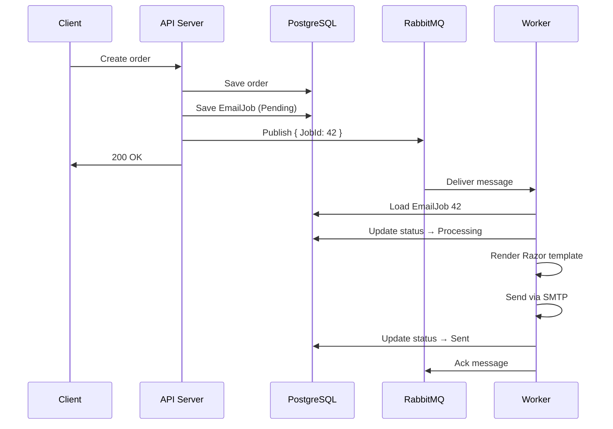
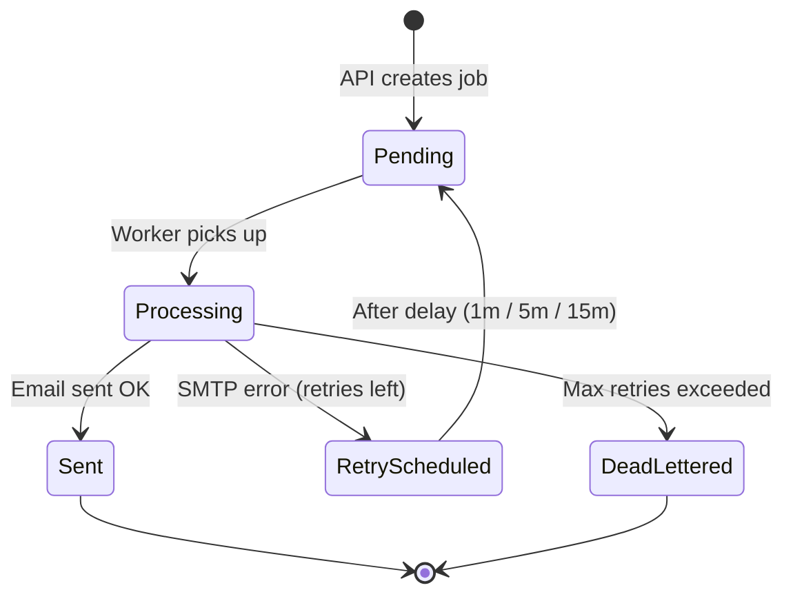
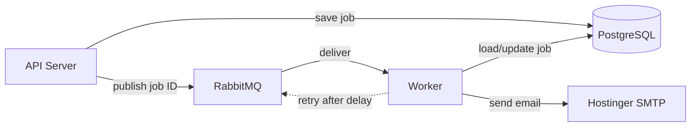
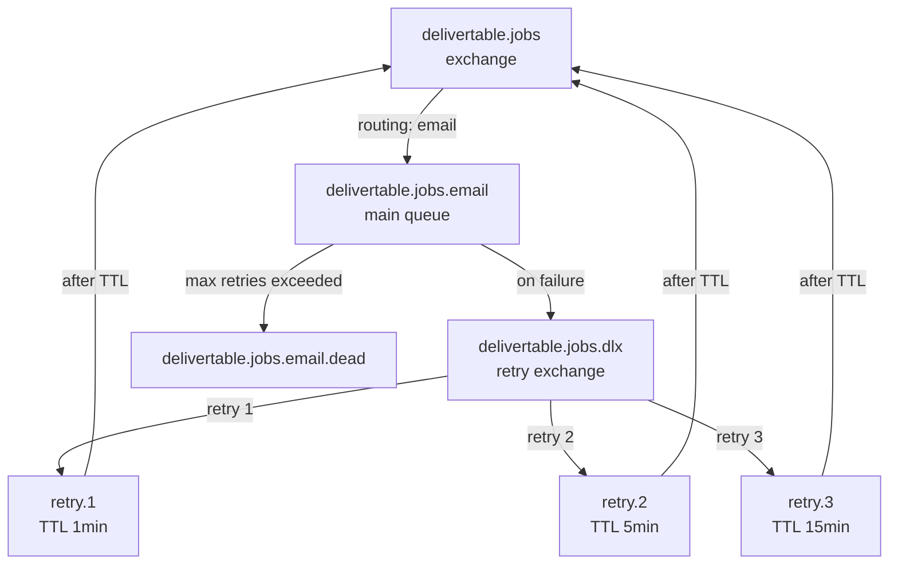

# Worker Architecture

## How an email gets sent



## Job lifecycle



## System overview



## RabbitMQ topology



## Recovery mechanisms

```mermaid
graph TD
    subgraph Sweep Service — runs every 60s
        S1[Find Pending jobs > 2 min old] -->|re-publish to RabbitMQ| RMQ[RabbitMQ]
        S2[Find Processing jobs > 5 min old] -->|reset to Pending| DB[(PostgreSQL)]
    end
```
