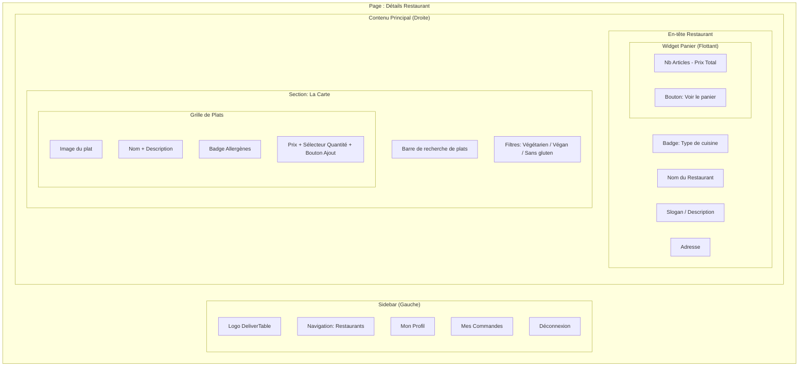
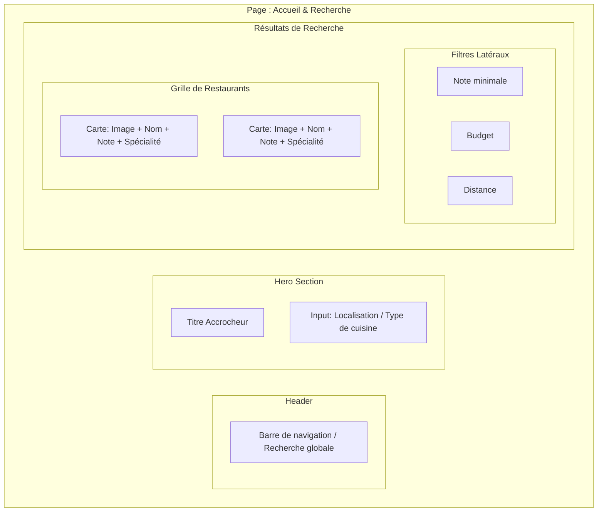
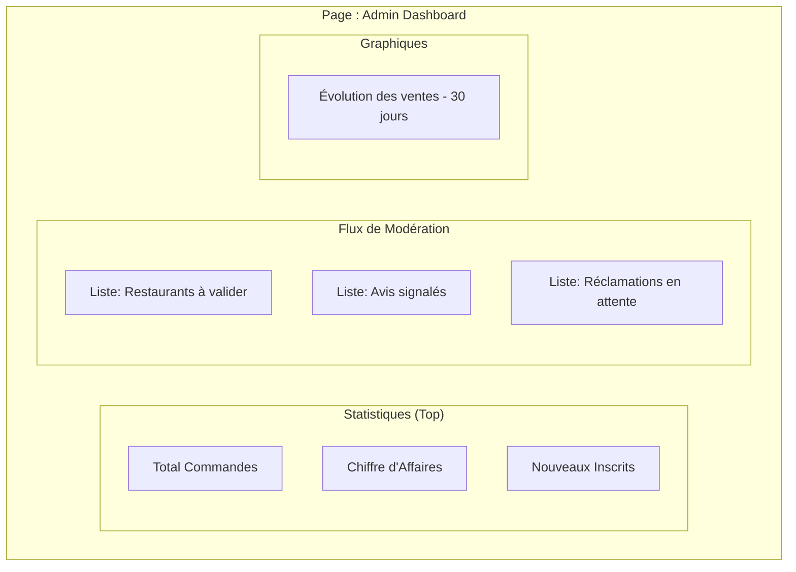
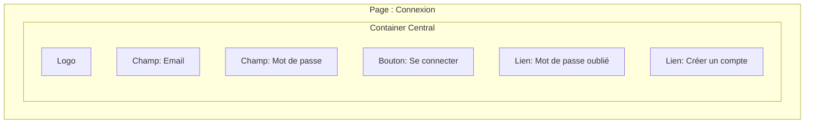

# Wireframes - DeliverTable

Ce document présente la structure (wireframes) des pages clés de l'application, basée sur les maquettes et captures d'écran du projet.

---

## 1. Détails du Restaurant (Basé sur la capture d'écran)

Ce wireframe représente la vue d'un client consultant la carte d'un établissement.

---

## 2. Page d'Accueil / Recherche de Restaurants

Structure de la page permettant la découverte des établissements.

---

## 3. Dashboard Administrateur

Vue consolidée pour la modération et le suivi du système.

---

## 4. Authentification (Login)

